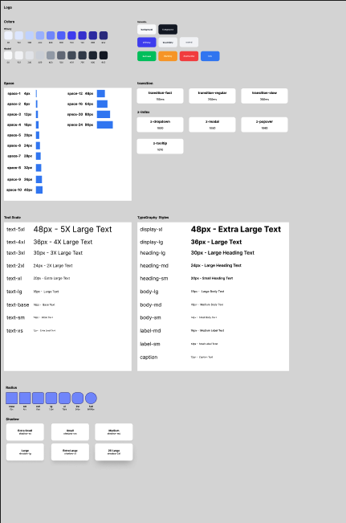

# 2026.2.10

## Done

- Figma 개설 및 2차 토큰 수정
- Github Actions 파이프라인 계획 수립 ( Figma 수정 -> npm 자동 배포 )
- 리드미 + docs 폴더 생성 -> 프로젝트 문서화 구조 변경

## 1. Figma 개설 및 2차 토큰 수정

[WUI Figma](https://www.figma.com/design/gwb1lulY9VdTa9alJIZuBU/Wonder-Design-Token?node-id=0-1&t=9YnBTcLwuGDnKjAb-1)

## 2. 토큰 변경 사항

### typoGraphy 재정의

기존 TypoGraphy는 단순히 `text-size`, `font-weight` 만을 고려한 느낌이 있었습니다. 이에 역할에 따라 `display, heading, body, label, cation` 으로 분류하여 재정의 하였습니다.

최초에는 각 분야별로 `xs~5xl`까지의 typo를 모두 정의했지만, 다음 우려가 있었습니다.

- 토큰 수가 너무 많아짐
- 개발자가 헷갈릴 수 있음
- 실제로 사용할까?

  **"개발자가 헷갈리지 않아야 한다"** 를 중점으로 하여, TypoGraphy를 **""필요한 것만 최소 세트로 정의"**하는 것으로 정했습니다.

### transition, z-index 추가

`transition`, `z-index`와 관련된 토큰을 새로 추가하였습니다.

`transition`은 0.3초를 가장 느린 시간으로 하여 0.2초 0.1초의 애니메이션 시간을 추가하였습니다.

`z-index`는 역할에 맞게 `dropdown`, `modal`, `popover`, `tooltip` 4가지로 분류하여 추가하였습니다. 추후 추가될 가능성이 있습니다.

## 2. Github Actions 파이프라인 계획 수립

Figma의 디자인 토큰 변경 사항이 npm 배포까지 자동 반영되도록 워크플로우를 구축했습니다.

- Figma에서 토큰 수정 후 Tokens Studio로 JSON export
- JSON을 레포지토리에 반영하면 GitHub Actions 실행
- JSON 토큰을 CSS 변수로 빌드(flat화)
- npm 패키지 배포
